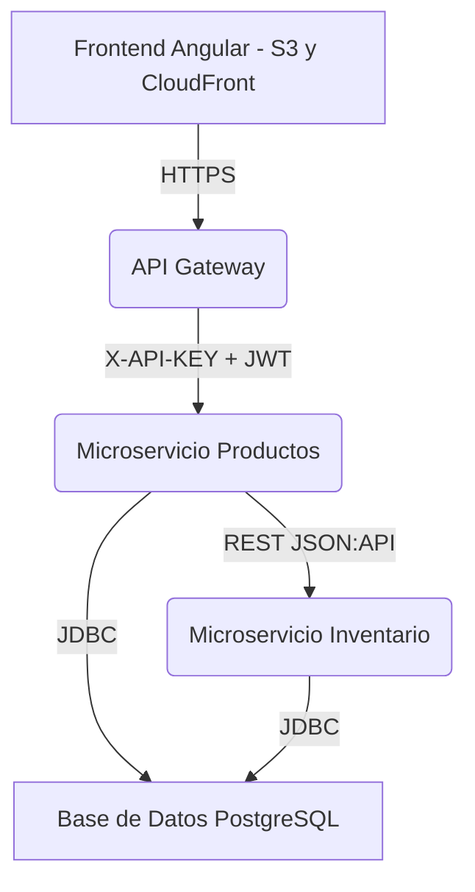

# Documentación Técnica - Sistema de Gestión de Productos e Inventario

## 1. Descripción General

Esta solución está compuesta por:

-   **Frontend Angular**: Interfaz de usuario para la gestión de productos.
    
-   **Microservicio de Productos (Java 21 + Spring Boot)**: Gestión CRUD de productos y consumo del microservicio de inventario.
    
-   **Microservicio de Inventario (Java 21 + Spring Boot)**: Operaciones relacionadas con la cantidad disponible por producto.
    

Comunicación entre componentes:

-   El **Frontend** interactúa con el **microservicio de productos**, que a su vez se comunica con el **microservicio de inventario**.
    
-   La autenticación entre componentes se realiza mediante **API Key** en header (`X-API-KEY`).
    

## 2. Arquitectura General

-   Arquitectura: Hexagonal (puertos y adaptadores implícitos)
    
-   Lenguaje: Java 21
    
-   Framework: Spring Boot 3+
    
-   Seguridad: API Key y mejora propuesta con JWT
    
-   Comunicación: REST JSON:API
    
-   Orquestación: Docker Compose (local)
    

## 3. Diagrama de Arquitectura (Markdown)



## 4. Microservicios

### 4.1. Microservicio de Productos

**Responsabilidad**:

-   Crear, leer, actualizar, eliminar productos
    
-   Gestionar inventario vía cliente REST hacia microservicio de inventario
    

**Endpoints relevantes**:

-   `POST /api/v1/productos`
    
-   `GET /api/v1/productos/{id}`
    
-   `PUT /api/v1/productos/{id}`
    
-   `DELETE /api/v1/productos/{id}`
    
-   `POST /api/v1/productos/filtro`
    

**DTOs y Mappers**:

-   Uso de clases internas anidadas estilo JSON:API
    
-   Mapeo manual con componentes `@Component`
    

### 4.2. Microservicio de Inventario

**Responsabilidad**:

-   Crear y actualizar cantidades de inventario por producto
    
-   Descontar inventario
    
-   Obtener listado por IDs
    

**Endpoints relevantes**:

-   `POST /api/v1/inventarios`
    
-   `PUT /api/v1/inventarios`
    
-   `POST /api/v1/inventarios/descontar`
    
-   `POST /api/v1/inventarios/buscar`
    

**Validación y errores**:

-   `@RestControllerAdvice` para manejo global
    
-   JSON:API-compliant error responses
    

## 5. Seguridad

### Actual

-   API Key (`X-API-KEY`) validada en cada microservicio
    
-   Configurada vía variables de entorno en Docker Compose
    

### Mejora propuesta

-   Autenticación de usuarios vía JWT para uso en frontend
    
-   API Gateway que valide JWT y reenvíe API Key internamente
    

## 6. Despliegue (Mejoras propuestas)

### Backend (EC2 - AWS)

-   Contenedores desplegados con Docker Compose
    
-   CI/CD con GitHub Actions
    
-   Acceso restringido mediante VPC Link
    

### Frontend (S3 + CloudFront)

-   Angular build (`ng build`) desplegado a un bucket S3
    
-   Distribución global mediante CloudFront
    

### API Gateway

-   Enlace entre público y microservicios privados (con VPC Link)
    
-   Validación de JWT tokens y redirección
    

## 7. Instrucciones de Despliegue Local

1.  Clonar repositorio y navegar a raíz del proyecto.
    
2.  Construir contenedores:
    

```bash
docker-compose build

```

3.  Levantar servicios:
    

```bash
docker-compose up -d

```

4.  Acceder a:
    

-   Productos: `http://localhost:8081/dev/productos`
    
-   Inventario: `http://localhost:8082/dev/inventario`
    

## 8. Diagramas de Arquitectura Hexagonal (Markdown)

### Microservicio de Productos


### Microservicio de Inventario


## 9. Estándares Técnicos

-   JSON:API para consistencia en contratos
    
-   `DTO` estructurados como `data -> attributes`
    
-   Mappers personalizados para transformación
    
-   `GlobalExceptionHandler` para respuestas formateadas
